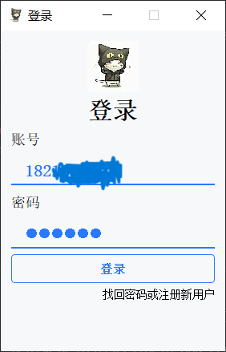
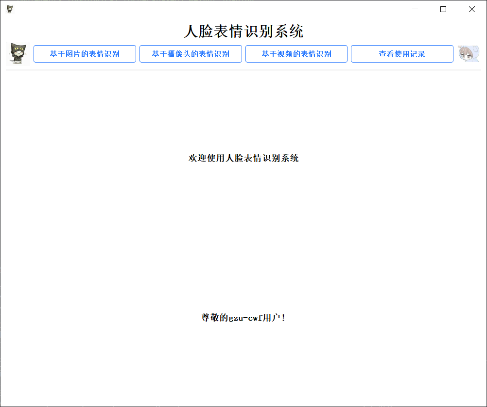
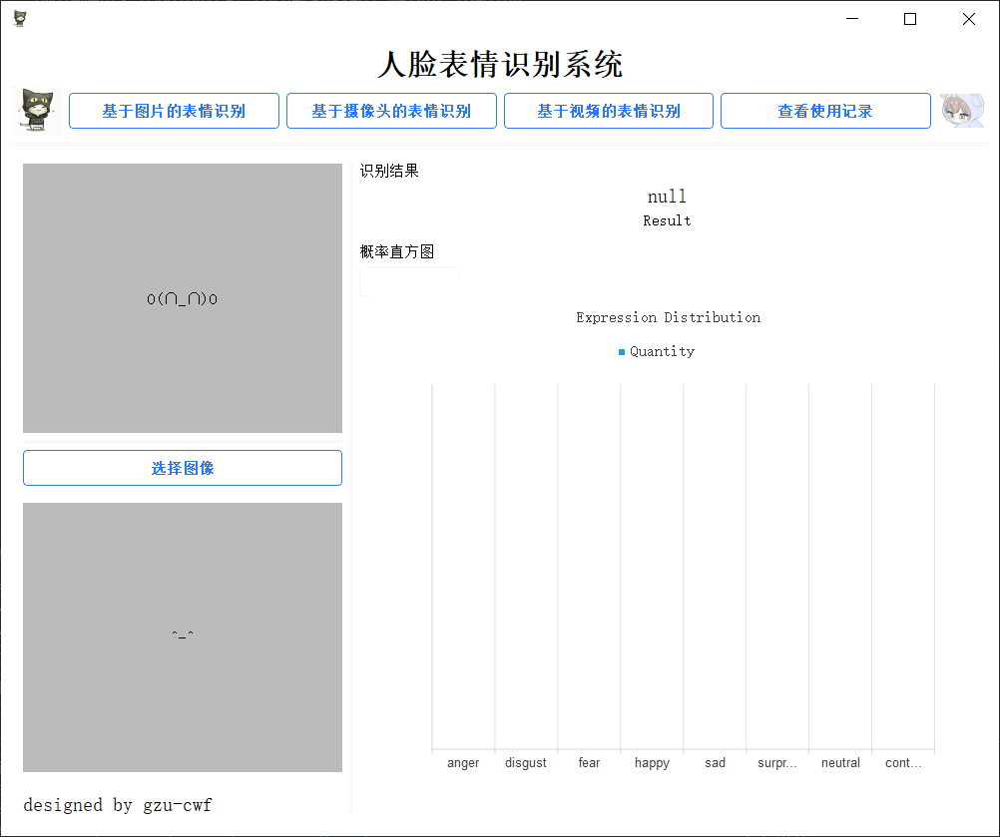
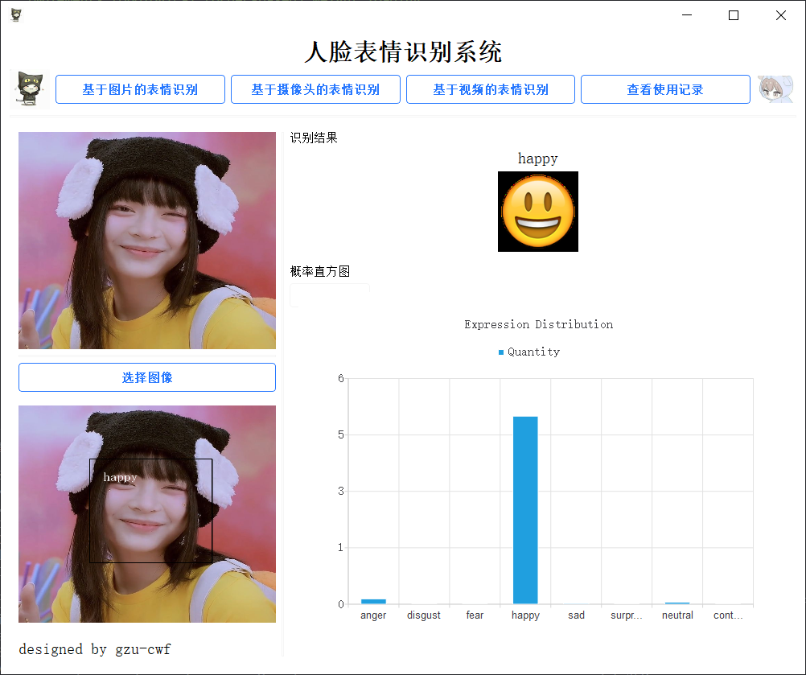
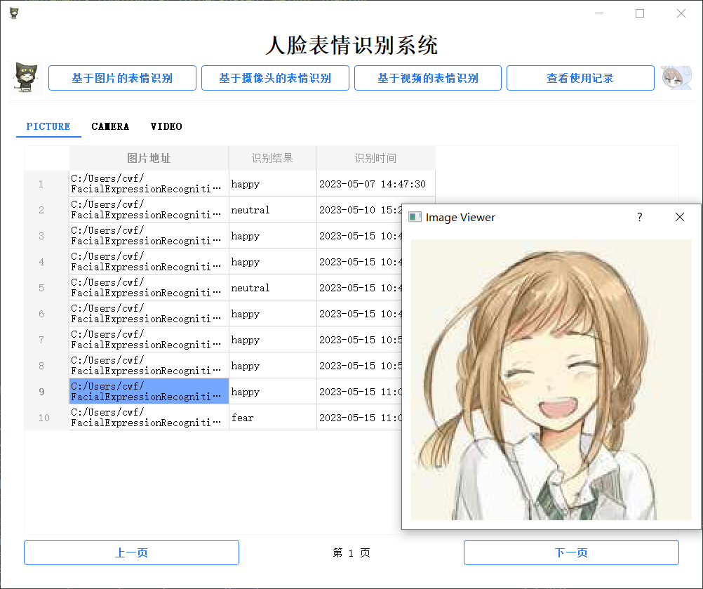
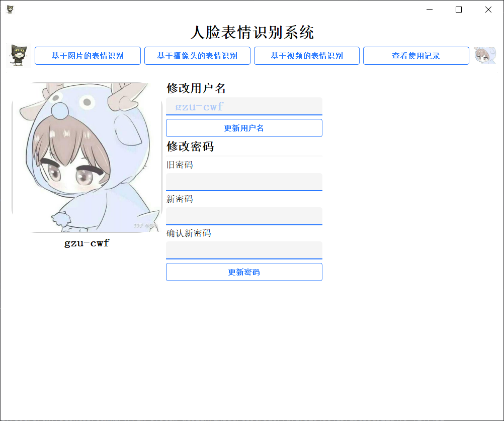

## 人脸表情识别系统  

#### 该系统主要有三个功能:  

<!-- - **视频表情识别** -->
- **摄像头在线表情识别**
- **本地视频离线表情识别**
- **图片表情识别**

### *1. 登录界面*

<!-- &emsp;   -->

首先在该系统中，账号就是手机号码，然后密码可以自己设置。如果没有账号，那么可以优先选择注册账号，然后再进行登录；当然如果忘记密码，也是可以在**右下角**进行找回。  

### *2. 系统主页*  

进入主页有欢迎语，以及四个功能按钮，当然点击右侧**用户头像**可以查看用户个人信息。
### *3. 图像表情识别*

介绍该系统的第一个功能，在首页上点击左上角**基于图片的表情识别**后，可以使用该功能。  

这里给出一个演示例子，点击**选择图像**，选择自己想要进行表情识别的图片后，可以得到以下结果。  

  
其中包含识别结果，原图，概率直方图以及表情识别区域图。
### *4. 视频表情识别*
这里给出一个演示实例，点击**上传视频**选择自己想要识别的视频，选择完毕后，点击**进行人脸表情识别**，效果展示如下图所示。

 
当然识别过程可以随时暂停和开始的，点击**PLAY**和**STOP**；点击**返回重新上传**可以对其他视频进行的表情识别。
 
基于摄像头的表情识别功能，和视频上传表情识别功能类似。只是把图像获取途径通过摄像头进行，所以这里不单独进行演示。
### *5. 用户使用记录及其他*
最后，简要说明一下该系统的一些其他功能  

首先用户对于每一次表情识别功能使用都会进行记录，以图片表情识别为例，在点击**图片地址**时可以弹出该图片，这个简单的交互，可以使用户更好的知道每个图片所对应的识别结果，得到更好的用户体验。

以及可以个人信息的修改，如用户头像，用户名以及密码。

